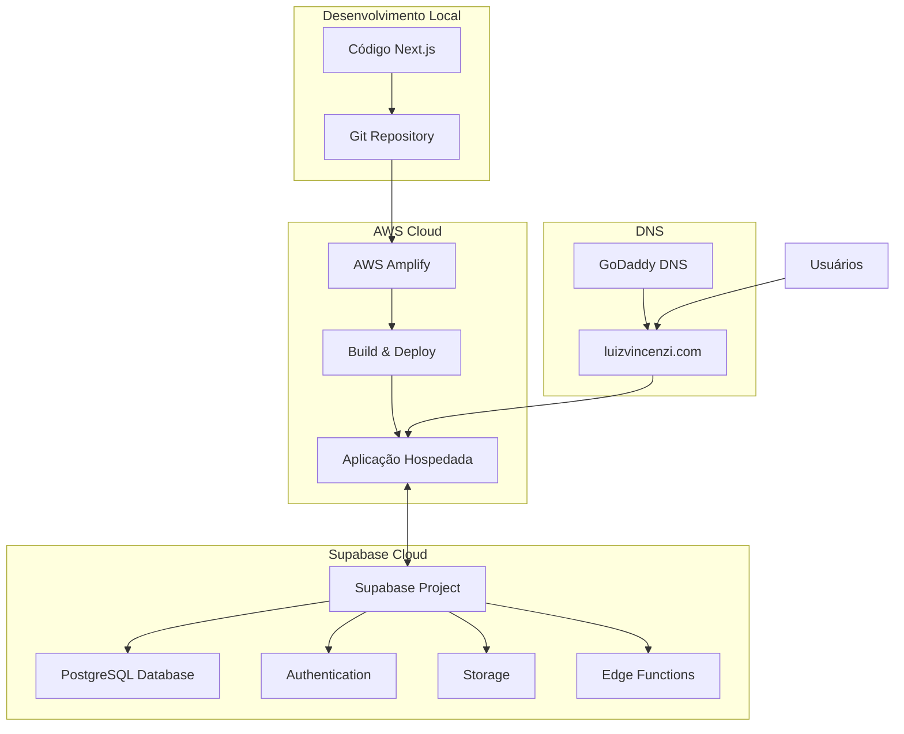
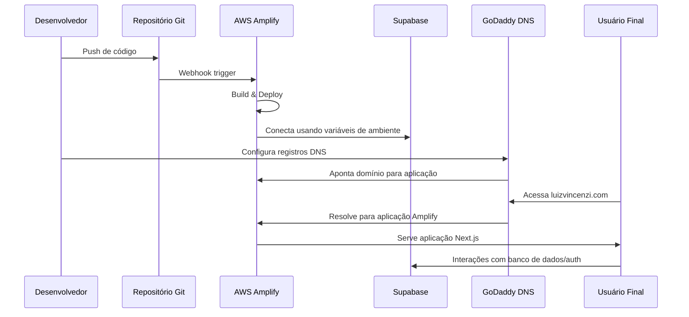
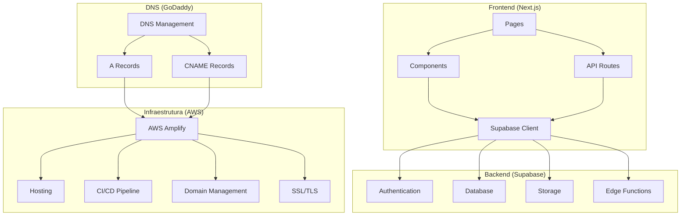
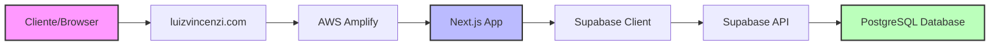
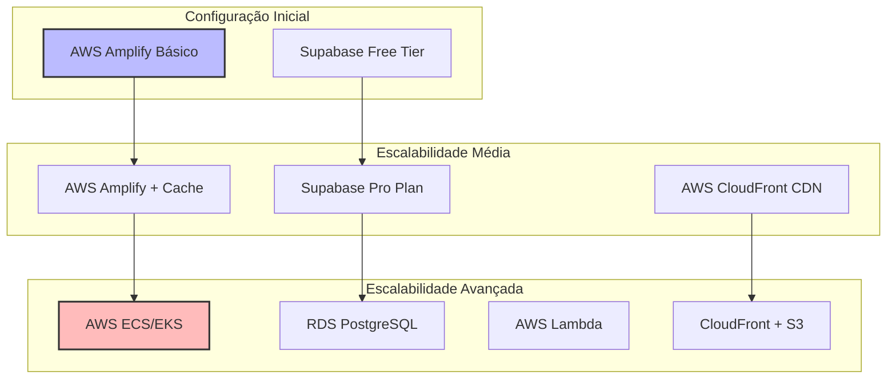

# Arquitetura de Implantação: Next.js + Supabase no AWS Amplify

Este documento apresenta diagramas visuais da arquitetura de implantação para ajudar a entender como os diferentes componentes se integram.

## Visão Geral da Arquitetura

## Fluxo de Implantação

## Estrutura de Componentes

## Fluxo de Dados

## Escalabilidade Futura

Estes diagramas fornecem uma visão visual da arquitetura de implantação, ajudando a entender como os diferentes componentes se integram e como o fluxo de dados ocorre no sistema.
